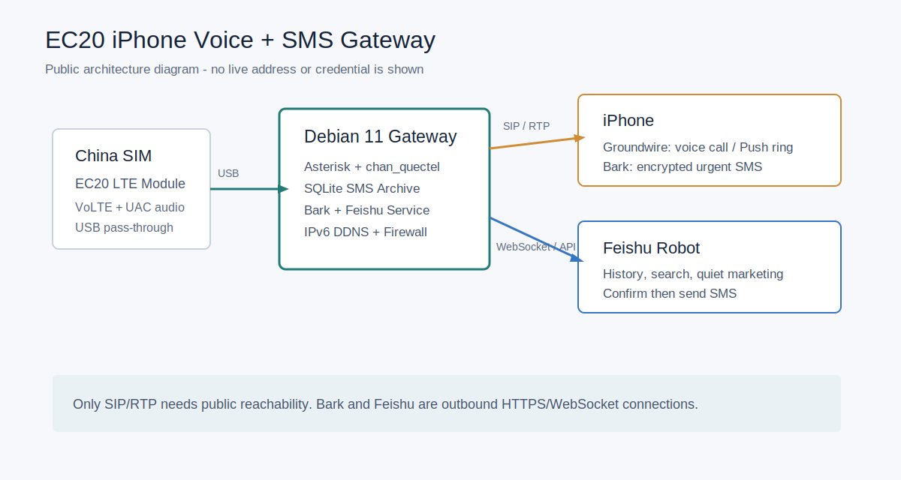

# EC20 iPhone Voice + SMS Gateway

把一张 SIM 卡托管在家中的 Quectel EC20 模块上，让仅支持 eSIM 的
iPhone 通过互联网继续使用原号码的电话与短信。

本项目是在 Debian 11 + Asterisk/Issabel + `chan_quectel` 上验证运行的增强方案：

- 电话：EC20 <-> Asterisk <-> Groundwire SIP Push
- 即时短信：Bark 加密通知
- 短信历史与发送：飞书自建应用机器人
- 本地归档：SQLite
- 静默营销：只进飞书，不打扰 Bark
- 聊天清理：机器人发出的飞书消息 7 天后自动撤回，SQLite 长期保留

## 来源与新增内容

本项目的电话基础路线来自
[AmorXxx/iPhone_air_esim_tutorial](https://github.com/AmorXxx/iPhone_air_esim_tutorial)：
EC20 + Debian 11 + Issabel/Asterisk + Groundwire，通过 SIM 托管实现电话和短信访问。

本项目在实机验证后新增：

- 公网 IPv6 直连、DNSPod AAAA DDNS 与最小防火墙规则
- Groundwire Push 来电下的 ICE 音频修复路径
- Bark AES-128-CBC 加密通知
- 飞书长连接机器人、短信历史查询与二次确认发送
- 短信分类策略及营销仅归档
- 飞书七日消息清理与 SQLite 长期存储
- 可重复安装脚本与隐私扫描

详细来源、采用理由和与原方案的差异记录在 [REFERENCES.md](REFERENCES.md)。

> 本项目不会把 SIM 转换为 eSIM；iPhone 本身仍需要可用的数据网络，
> 才能连接家中的语音网关。



## 已验证环境

| 项目 | 版本/方案 |
| --- | --- |
| 系统 | Debian 11.11 `amd64` |
| 电话核心 | Asterisk 16 + `asterisk-chan-quectel` |
| LTE 模块 | Quectel EC20，VoLTE + UAC 音频 |
| SIP 客户端 | Groundwire，Push 来电 |
| 公网接入 | IPv6 直连 + DNSPod AAAA DDNS |
| SIP / RTP | TCP/UDP `5160`，UDP `10000-10010` |
| 短信通知 | Bark，AES-128-CBC 加密 |
| 历史与指令 | 飞书企业自建应用机器人，长连接事件 |

## 先看结论

这是一个适合长期放在家里运行的方案，但有四个边界要先接受：

1. 电话公网接入需要可达的公网 IPv6、IPv4 或中继方案；本项目验证的是公网 IPv6。
2. Groundwire 的稳定 Push 来电是付费功能；免费 SIP 客户端能注册不等于能可靠后台接电话。
3. `chan_quectel` 存在已知风险：通话中收到短信可能导致模块崩溃，需要长期观察。
4. Bark 的 `passive` 并不是“只存历史不出现通知”；因此营销短信转到飞书保存。

## 处理策略

| 短信类型 | Bark | 飞书 | SQLite |
| --- | --- | --- | --- |
| 验证码/动态口令 | 加密时效通知 | 只记录收到，不写正文 | 正文本地保存 |
| 欠费/停机/流量将耗尽/异常 | 加密时效通知 | 完整记录 | 完整记录 |
| 普通服务通知/个人短信 | 加密普通通知 | 完整记录 | 完整记录 |
| 贷款/房产/保险/培训/促销/通信营销 | 不通知 | 完整记录 | 完整记录 |

飞书查询和发短信命令：

```text
最近 5
查短信 今天
查短信 7天
查短信 号码 10086
查短信 关键词 流量
查短信 分类 营销
短信统计
发短信 10086 查询余额
确认 123456
```

## 部署路线

第一次搭建建议按顺序执行：

1. [硬件、Debian 和 USB 直通](docs/01-hardware-debian.md)
2. [EC20、VoLTE 与 UAC 音频](docs/02-ec20-volte-uac.md)
3. [Issabel/Asterisk 与 Groundwire 电话](docs/03-voice-groundwire.md)
4. [公网 IPv6、DDNS 与防火墙](docs/04-network-security.md)
5. [Bark 与飞书短信项目](docs/05-sms-bark-feishu.md)
6. [一键安装与验收](docs/06-install-and-verify.md)
7. [日常运维与故障定位](docs/07-operations-troubleshooting.md)

## 一键安装覆盖范围

在电话已可用、Asterisk 已加载 `chan_quectel` 后，SMS/通知/历史部分可一键部署：

```bash
cp gateway.env.example gateway.env
nano gateway.env
sudo bash install.sh
sudo bash verify.sh
```

脚本会安装：

- 短信分类、SQLite 与 Bark 推送脚本
- 飞书长连接机器人与七日清理计时器
- Asterisk `incoming-mobile` SMS 自定义入口
- 可选 DNSPod IPv6 DDNS
- 可选最小化 nftables IPv6 公网规则

脚本不会自动替你在 Issabel 网页中创建分机、中继与呼入/呼出路由，也不会自动向
EC20 写入可能影响固件或网络注册状态的 AT 指令。

## 隐私说明

仓库中不包含真实的：

- 域名、IPv4/IPv6 地址、内网网段
- 电话号码、IMEI、IMSI
- SIP 密码、Bark Key/加密 Key/IV
- 飞书 App ID/App Secret、绑定码
- DNSPod Token

图片采用无凭证的配置示意图而非真实后台截图。发布自己的 fork 前请运行：

```bash
bash scripts/privacy-scan.sh
```

## 参考来源

- 原始 EC20 + Issabel + Groundwire 思路：
  [AmorXxx/iPhone_air_esim_tutorial](https://github.com/AmorXxx/iPhone_air_esim_tutorial)
- Bark 加密协议：
  [Bark encryption documentation](https://raw.githubusercontent.com/Finb/Bark/master/docs/encryption.md)
- 飞书长连接事件与消息 API：
  [飞书开放平台](https://open.feishu.cn/document/home/index)
- 短信规则参考：
  [SmsForwarder](https://github.com/pppscn/SmsForwarder) 与
  [FBS SMS Dataset](https://github.com/Cypher-Z/FBS_SMS_Dataset)
