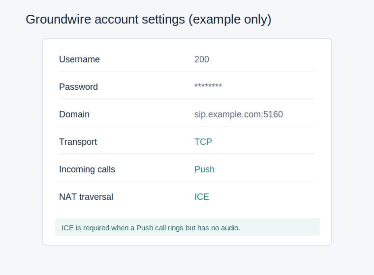

# 03. Issabel/Asterisk 与 Groundwire 电话

电话部分以 Issabel 图形界面为主，不纳入自动脚本覆盖范围，原因是现有分机、中继、
入站路由和密码都可能不同。

## 软件组件

- Issabel / Asterisk 16
- 与 Asterisk 版本匹配的 `asterisk-chan-quectel`
- iPhone 上的 Groundwire

原始安装路线请先参考：
[AmorXxx/iPhone_air_esim_tutorial](https://github.com/AmorXxx/iPhone_air_esim_tutorial)。
完成后再按本章加入公网 IPv6 与音频修复项。

## Issabel 中需要创建的对象

### PJSIP 分机

创建一个只供手机使用的 PJSIP 分机，例如：

```text
Extension: 200
Secret: 请生成强密码
Codecs: ulaw, alaw
```

不要把分机密码提交到 Git。

### EC20 自定义中继

核心拨号字符串：

```text
Quectel/quectel0/$OUTNUM$
```

### 呼出路由

初次测试可配置模式：

```text
X.
```

上线后可按你的拨号习惯限制规则。

### 呼入路由

来自 `quectel0` 的普通电话交给目标 PJSIP 分机。短信由本项目的
`incoming-mobile,sms` 入口处理。

## 公网 SIP 端口

公网 SIP 使用非默认端口 `5160`。在 Issabel 的 SIP 设置中把 TCP/UDP 监听端口调整
为 `5160`，RTP 范围可收窄为：

```text
10000-10010
```

IPv6 transport 示例文件位于：

- `templates/pjsip_transport_custom.conf`
- `templates/pjsip_custom_post.conf`

应用前把扩展号 `200` 替换为自己的分机，然后：

```bash
sudo cp templates/pjsip_transport_custom.conf /etc/asterisk/pjsip_transport_custom.conf
sudo cp templates/pjsip_custom_post.conf /etc/asterisk/pjsip_custom_post.conf
sudo asterisk -rx "pjsip reload"
sudo asterisk -rx "pjsip show transports"
sudo asterisk -rx "pjsip show endpoint 200"
```

应看到 `[::]:5160` transport，且终端的 `ice_support` 为 `true`。

## Groundwire 配置

在 iPhone 创建 Generic SIP Account：

| 项目 | 填写内容 |
| --- | --- |
| 用户名 | Issabel 分机号，例如 `200` |
| 密码 | 分机 Secret |
| 域名 | 你的 DDNS 域名加 `:5160` |
| Transport | TCP |
| Incoming Calls | Push |
| NAT Traversal | ICE |



## 为什么需要 ICE

实测中，Push 来电已经能够弹出，但接听无声音；日志显示 Groundwire/SIPIS 回答的媒体
地址是手机侧私网地址。启用终端 ICE 后，媒体才能选择实际可达路径，来回通话恢复。

## 电话验收

1. 手机通过 Groundwire 拨打另一个号码，确认双向声音。
2. 从外部电话拨打 EC20 中的 SIM，确认后台 Push 响铃并可接听。
3. 在 Wi-Fi 与蜂窝网络各测一次。
4. 至少做一次较长通话并确认挂机释放。

