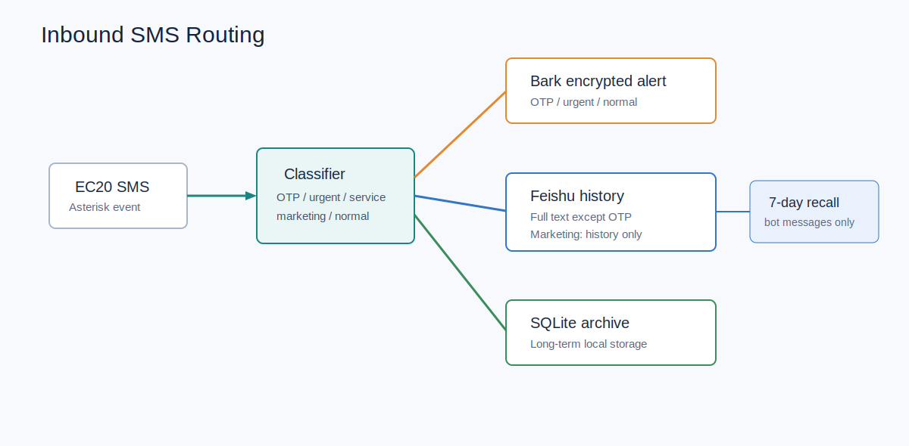
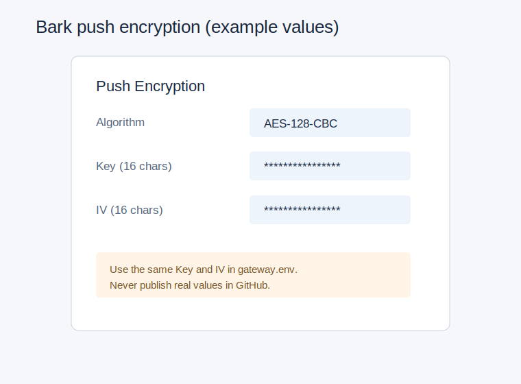
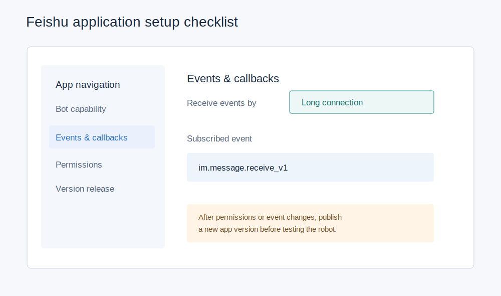

# 05. Bark 与飞书短信项目

## 产品设计

短信通道被拆成三层：

1. **Bark**：只承担需要及时看到的通知，且正文加密。
2. **飞书机器人**：承担可读历史、按条件查询、从聊天发短信。
3. **SQLite**：家庭服务器上的长期原始记录，不依赖聊天记录生命周期。

这样避免维护网页后台，也避免营销短信挤满 iPhone 通知中心。



## Bark 配置

在 Bark 首页复制推送地址，取得 URL 中的设备 Key。不要使用设置页面里的 APNs
Device Token。

在 Bark -> `推送加密` 中选择 `AES-128-CBC`，设置：

- 16 位 Key
- 16 位 IV

在 `gateway.env` 中填入同样的 Key 与 IV：

```bash
BARK_DEVICE_KEY=replace_with_bark_device_key
BARK_ENCRYPTION_KEY=replace_16_chars
BARK_ENCRYPTION_IV=replace_16_chars
```

锁屏上不直接显示短信正文属于 iPhone 设置，不属于 Bark 加密：

```text
设置 -> 通知 -> Bark -> 显示预览 -> 解锁时
```



## 飞书应用配置

创建“企业自建应用”，例如 `EC20 短信助手`：

1. 添加机器人能力。
2. 在权限管理中开通读取用户发给机器人的单聊消息、以应用身份发送消息，以及撤回
   应用自身消息所需权限。
3. 在事件与回调中选择“使用长连接接收事件”。
4. 添加事件 `im.message.receive_v1`（接收消息 v2.0）。
5. 发布应用版本，并确保当前用户在可用范围内。

安装服务后，私聊机器人：

```text
绑定 123456
```

其中数字是 `gateway.env` 中的 `FEISHU_BIND_CODE`。



## 分类逻辑

短信分类采用保守规则，优先防止“错过重要短信”，而不是追求营销识别率：

| 类别 | 判断方向 | 实际动作 |
| --- | --- | --- |
| OTP | 验证码、授权码、动态口令、交易码等 + 数字码 | Bark 时效通知；飞书脱敏 |
| urgent | 欠费、停机、流量即将用尽、异常、风险等 | Bark 时效通知 + 飞书全文 |
| service | 流量、套餐、余额、账单、缴费等 | Bark 普通通知 + 飞书全文 |
| promo | 贷款/房产/保险/教育/零售/通信业务 + 明确营销词 | 仅飞书全文 |
| normal | 其他内容 | Bark 普通通知 + 飞书全文 |

营销规则参考真实短信类别，但没有把号码段或单一词语直接当垃圾短信。例如一条
带“流量”的套餐提醒仍会被保留并通知。

## 飞书历史保留

机器人发送到飞书的消息会记录 `message_id`，由定时器每日撤回超过七天的消息。
SQLite 内容不因撤回而删除。

注意：飞书租户管理员可能限制消息可撤回时间。如果限制小于七天，需在飞书管理设置
中放宽，否则系统会记录撤回失败。
